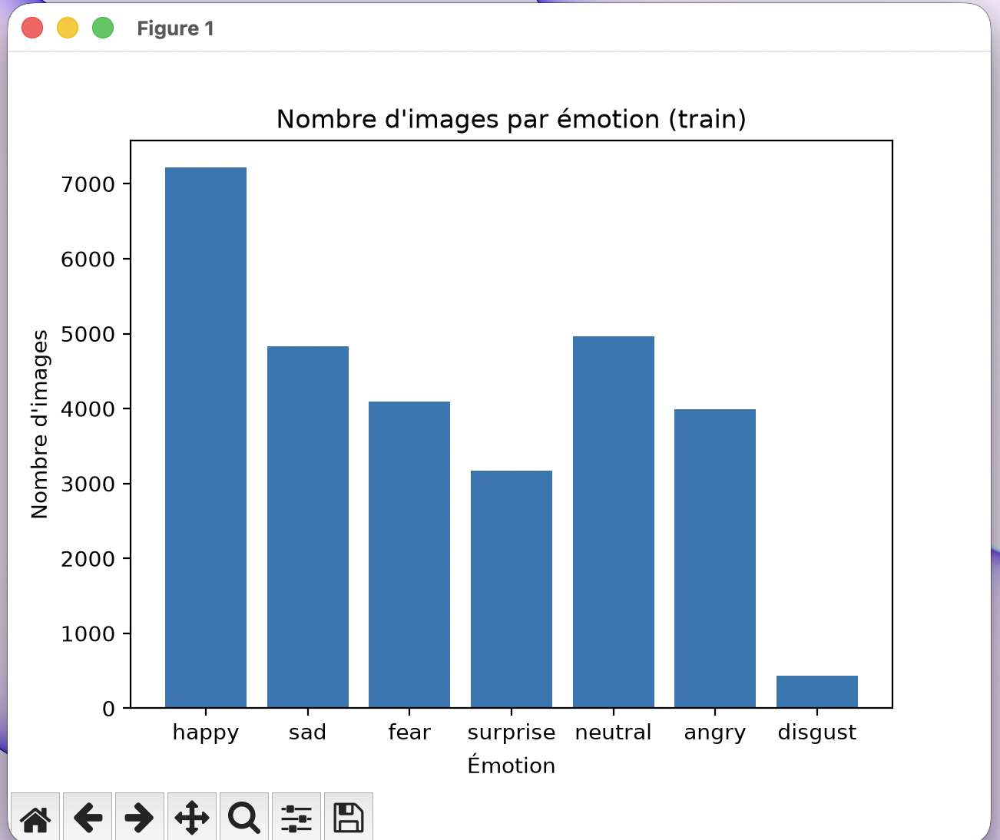
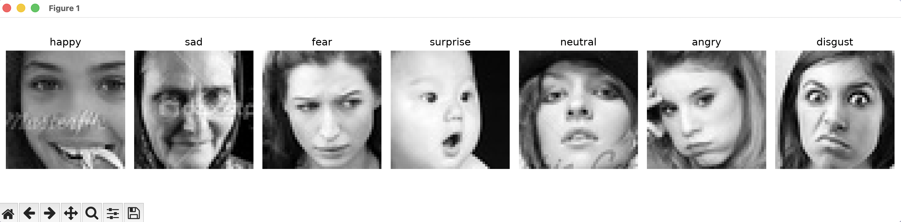

# 🎭 Facial Emotion Recognition

Real-time emotion recognition app via webcam (CNN/deep learning) that offers personalized support based on the detected emotional state.

## À propos

Ce projet détecte les émotions faciales en temps réel via webcam, à partir d'un CNN entraîné sur le dataset FER2013. L'objectif est aussi d'explorer comment une application peut proposer un accompagnement adapté selon l'état émotionnel détecté.

**7 émotions reconnues :** angry, disgust, fear, happy, neutral, sad, surprise

## Dataset

Le modèle est entraîné sur [FER2013](https://www.kaggle.com/datasets/msambare/fer2013) : 35 887 images de visages en niveaux de gris, 48x48 pixels.

Répartition des images d'entraînement par émotion :



Le dataset est déséquilibré (`disgust` est largement sous-représenté par rapport aux autres émotions), ce qui influence les performances du modèle sur cette classe en particulier.

Exemples d'images du dataset :



## Résultats

- **Accuracy (train) :** ~63%
- **Accuracy (validation) :** ~54.5%

À titre de comparaison, la précision humaine moyenne sur ce dataset est estimée autour de 65% (certaines images sont ambiguës même pour un œil humain).

## Installation

### Prérequis

- Python 3.10, 3.11 ou 3.12 (TensorFlow n'est pas encore compatible avec les toutes dernières versions de Python)
- Un compte [Kaggle](https://www.kaggle.com) (gratuit) pour télécharger le dataset

### Étapes

1. **Cloner le repo**

```bash
git clone https://github.com/laetitia-lili/facial-emotion-recognition.git
cd facial-emotion-recognition
```

2. **Créer et activer un environnement virtuel**

```bash
python3 -m venv venv
source venv/bin/activate        # Mac/Linux
venv\Scripts\activate           # Windows
```

3. **Installer les dépendances**

```bash
pip install -r requirements.txt
```

4. **Configurer l'accès Kaggle**

- Va sur [kaggle.com](https://kaggle.com) → Settings → API Tokens → Create New Token
- Sauvegarde ton token :

```bash
mkdir -p ~/.kaggle
echo TON_TOKEN_ICI > ~/.kaggle/access_token
chmod 600 ~/.kaggle/access_token
```

## Utilisation

### Explorer le dataset

```bash
cd notebooks
python3 explore_data.py
```

### Entraîner le modèle

```bash
cd src
python3 train.py
```

Le modèle entraîné est sauvegardé dans `models/emotion_model.keras`.

### Lancer l'application webcam

```bash
cd src
python3 webcam_app.py
```

Appuie sur **q** pour quitter l'application.

> Sur Mac, la première fois, autorise l'accès à la caméra pour Terminal/VS Code dans **Réglages Système → Confidentialité et sécurité → Appareil photo**.

## Structure du projet

```
facial-emotion-recognition/
├── assets/                # captures d'écran pour le README
├── notebooks/
│   └── explore_data.py    # exploration et visualisation du dataset
├── src/
│   ├── data_loader.py     # téléchargement et exploration du dataset
│   ├── preprocessing.py   # chargement, split, normalisation
│   ├── model.py            # architecture du CNN
│   ├── train.py            # entraînement du modèle
│   └── webcam_app.py       # application temps réel
├── models/                 # modèles entraînés (non versionné)
├── requirements.txt
└── README.md
```

## Stack technique

- **Python 3.12**
- **TensorFlow / Keras** — construction et entraînement du CNN
- **OpenCV** — capture webcam et détection de visage
- **NumPy / Pandas** — manipulation des données

## Pistes d'amélioration

- Gérer le déséquilibre des classes (class weights ou data augmentation ciblée)
- Ajouter de la data augmentation générale pour réduire l'écart train/validation
- Tester un détecteur de visage plus robuste que Haar Cascade (ex: MediaPipe)
- Ajouter le module d'accompagnement émotionnel (messages/suggestions selon l'émotion détectée)
